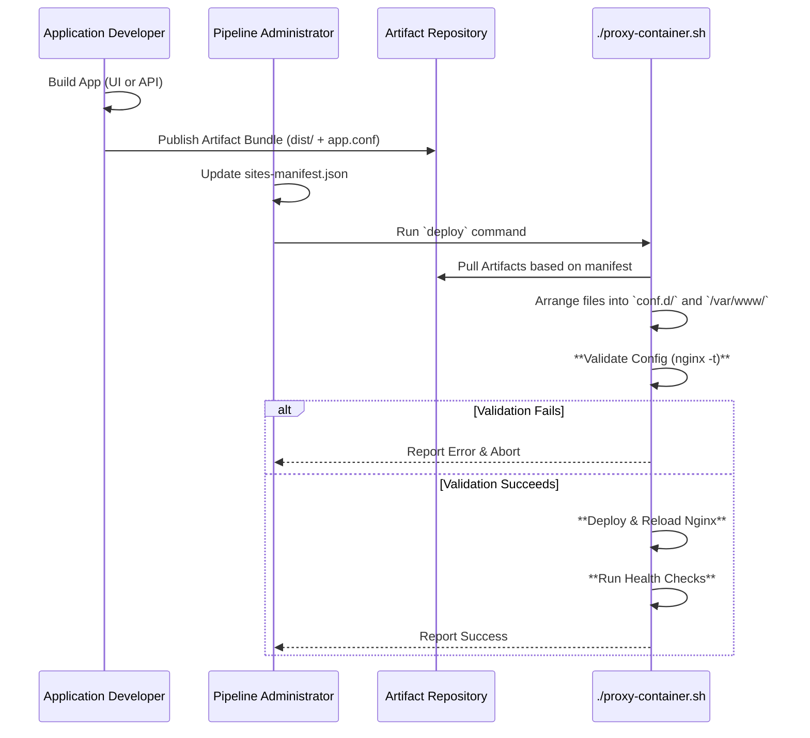

# Nginx Reverse Proxy Pipeline Architecture

## 1. Overview

This document outlines the architecture of the Nginx Reverse Proxy Pipeline. The primary goal of this system is to provide a safe, automated, and maintainable process for deploying and managing all web-facing applications.

It was designed to solve the challenges of manual, error-prone Nginx configuration changes and to provide a high-fidelity local development environment that mirrors production.

## 2. Core Principles

- **Infrastructure as Code:** The entire Nginx configuration and deployment logic is treated as code, stored in this version-controlled repository.
- **Separation of Concerns:** This pipeline project is intentionally separate from application projects. The pipeline manages *how* an app is hosted; the app manages *what* it does.
- **Safety Through Automation:** Every step is designed to be automated and validated to prevent human error and minimize the risk of production outages.
- **Immutability (The "Pull" Model):** The pipeline operates on a "pull" model. The central deployment script is the single source of truth. It *pulls* application artifacts from a designated location. Application build processes never "push" or write directly to the proxy's configuration.

## 2.1. Multi-Stage Pipeline Architecture

The pipeline implements a **seed → wip → prep → ship** architecture for safe, iterative development and deployment:

- **🌱 seed**: Exact production replica for troubleshooting and debugging
- **🔧 wip**: Work-in-progress development workspace for making changes  
- **📦 prep**: Clean build ready for staging validation
- **🚀 ship**: Production deployment

### Stage Separation
Each stage maintains complete isolation:
- **Separate workspaces**: `/workspace/seed`, `/workspace/wip`, `/runtime` (prep)
- **Separate containers**: `nginx-rp-seed`, `nginx-rp-wip`, `nginx-rp-prep` 
- **Separate ports**: 8080 (seed), 8081 (wip), 8082 (prep)
- **Independent lifecycles**: Changes flow seed→wip→prep, never backwards

### External Services vs Pipeline Apps
- **External Services** (e.g., `vaultwarden-ship`): Stable, single instance, don't go through pipeline
- **Pipeline Apps**: Go through full seed→wip→prep→ship cycle with port allocation per stage

## 3. Key Components

### 3.1. The `proxy-container.sh` Script
This is the central orchestrator of the entire pipeline. It is a bash script responsible for:
- Reading the deployment manifest.
- Pulling and arranging application artifacts.
- Validating Nginx configurations (`nginx -t`).
- Managing the Docker container lifecycle.
- Running automated health checks.
- Handling atomic deployments and rollbacks.

### 3.2. Modular Configuration (`conf.d`)
To ensure maintainability and avoid a monolithic `nginx.conf` file, we use the `conf.d` pattern.
- The main `nginx.conf` contains only global and `http` block settings.
- It uses `include /etc/nginx/conf.d/*.conf;` to load all site-specific configurations.
- Each application provides its own `app.name.conf` file, which is placed in this directory.
- Disabling a site is as simple as renaming its file to `app.name.conf.disabled`. This pattern was chosen over the `sites-available`/`sites-enabled` symlink pattern for its superior cross-platform compatibility (especially with Windows).

### 3.3. The Deployment Manifest (`sites-manifest.json`)
This file is the single source of truth for the pipeline. It is a JSON file that lists every site the proxy is responsible for.
- **Purpose:** It tells the `proxy-container.sh` script which applications to deploy and test.
- **Example:**
  ```json
  {
    "sites": [
      { "name": "pronunco-ui", "domain": "app.pronunco.com" },
      { "name": "pronunco-api", "domain": "api.pronunco.com" }
    ]
  }
  ```

### 3.4. Enhanced Application Artifact Bundle

The "contract" between application teams and the pipeline has been enhanced to support both static assets and backend services. Teams provide a versioned `.zip` archive containing:

**Structure:**
```
awesome-app-v2.1.zip
├── dist/                    # Static build assets
├── nginx/
│   └── awesome-app.conf     # Nginx server block
└── containers/              # Backend service definitions (optional)
    └── awesome-app.yml      # Docker Compose-style container specs
```

**Static Site Example:**
```nginx
# nginx/awesome-app.conf
server {
    include /etc/nginx/ports.conf;  # Dynamic port allocation
    server_name awesome-app.pronunco.com;
    
    location / {
        root /var/www/awesome-app/;
        index index.html;
        try_files $uri $uri/ /index.html;
    }
}
```

**API Service Example:**
```yaml
# containers/awesome-api.yml
services:
  awesome-api:
    image: awesome-team/api:v2.1
    ports: ["${APP_PORT}:3000"]
    environment:
      - NODE_ENV=${STAGE}
```

**Dynamic Port Allocation:**
- Each stage gets unique port ranges: seed (9000-9999), wip (10000-10999), prep (11000-11999)
- Port = `stage_base + hash(app_name) % 900 + 100`
- Templates like `${APP_PORT}` and `${STAGE}` are substituted per deployment stage

### 3.5. Local SSL (`mkcert`)
To enable high-fidelity local development and testing, the pipeline is designed to work with `mkcert`. This allows developers to generate locally-trusted SSL certificates and run a full HTTPS environment on their machine that perfectly mimics production.

## 4. Deployment Workflow

The following diagram illustrates the end-to-end workflow:

