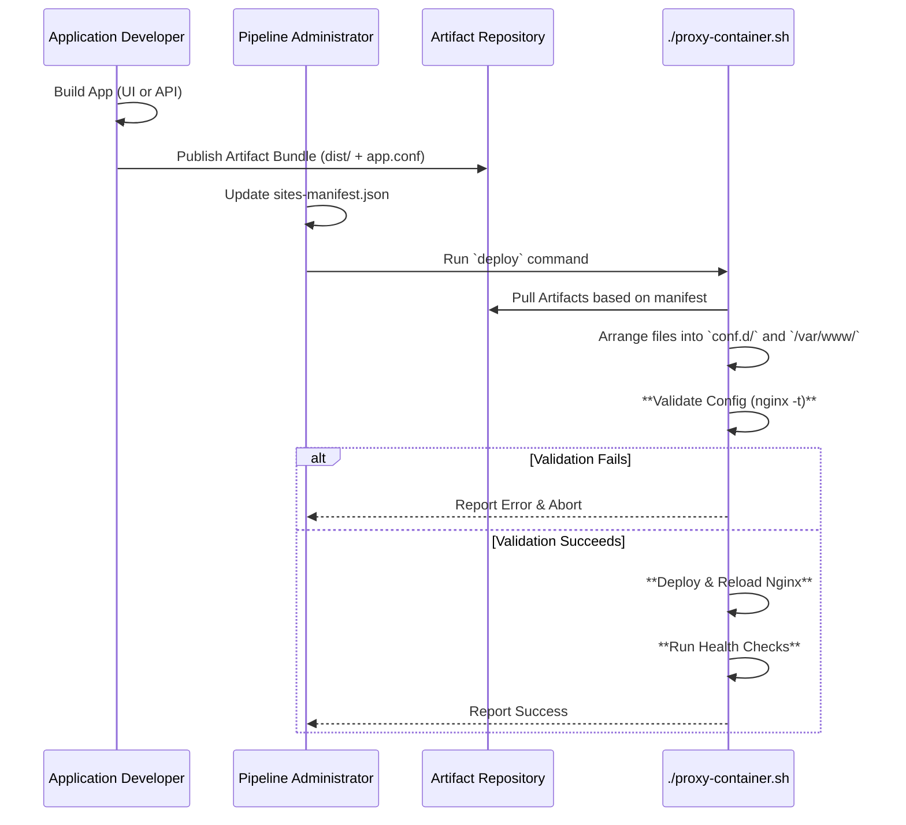

# Nginx Reverse Proxy Pipeline Architecture

## 1. Overview

This document outlines the architecture of the Nginx Reverse Proxy Pipeline. The primary goal of this system is to provide a safe, automated, and maintainable process for deploying and managing all web-facing applications.

It was designed to solve the challenges of manual, error-prone Nginx configuration changes and to provide a high-fidelity local development environment that mirrors production.

## 2. Core Principles

- **Infrastructure as Code:** The entire Nginx configuration and deployment logic is treated as code, stored in this version-controlled repository.
- **Separation of Concerns:** This pipeline project is intentionally separate from application projects. The pipeline manages *how* an app is hosted; the app manages *what* it does.
- **Safety Through Automation:** Every step is designed to be automated and validated to prevent human error and minimize the risk of production outages.
- **Immutability (The "Pull" Model):** The pipeline operates on a "pull" model. The central deployment script is the single source of truth. It *pulls* application artifacts from a designated location. Application build processes never "push" or write directly to the proxy's configuration.

## 3. Key Components

### 3.1. The `proxy-container.sh` Script
This is the central orchestrator of the entire pipeline. It is a bash script responsible for:
- Reading the deployment manifest.
- Pulling and arranging application artifacts.
- Validating Nginx configurations (`nginx -t`).
- Managing the Docker container lifecycle.
- Running automated health checks.
- Handling atomic deployments and rollbacks.

### 3.2. Modular Configuration (`conf.d`)
To ensure maintainability and avoid a monolithic `nginx.conf` file, we use the `conf.d` pattern.
- The main `nginx.conf` contains only global and `http` block settings.
- It uses `include /etc/nginx/conf.d/*.conf;` to load all site-specific configurations.
- Each application provides its own `app.name.conf` file, which is placed in this directory.
- Disabling a site is as simple as renaming its file to `app.name.conf.disabled`. This pattern was chosen over the `sites-available`/`sites-enabled` symlink pattern for its superior cross-platform compatibility (especially with Windows).

### 3.3. The Deployment Manifest (`sites-manifest.json`)
This file is the single source of truth for the pipeline. It is a JSON file that lists every site the proxy is responsible for.
- **Purpose:** It tells the `proxy-container.sh` script which applications to deploy and test.
- **Example:**
  ```json
  {
    "sites": [
      { "name": "pronunco-ui", "domain": "app.pronunco.com" },
      { "name": "pronunco-api", "domain": "api.pronunco.com" }
    ]
  }
  ```

### 3.4. The Application Artifact Bundle
This is the "contract" between an application team and the pipeline. To be deployed, an application must provide a versioned `.zip` archive containing:
1.  `dist/`: A directory with the application's static build assets.
2.  `app.conf`: The Nginx `server` block configuration for that specific application.

### 3.5. Local SSL (`mkcert`)
To enable high-fidelity local development and testing, the pipeline is designed to work with `mkcert`. This allows developers to generate locally-trusted SSL certificates and run a full HTTPS environment on their machine that perfectly mimics production.

## 4. Deployment Workflow

The following diagram illustrates the end-to-end workflow:

