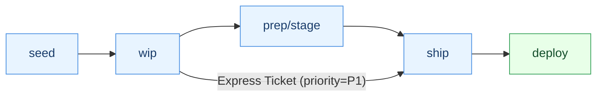
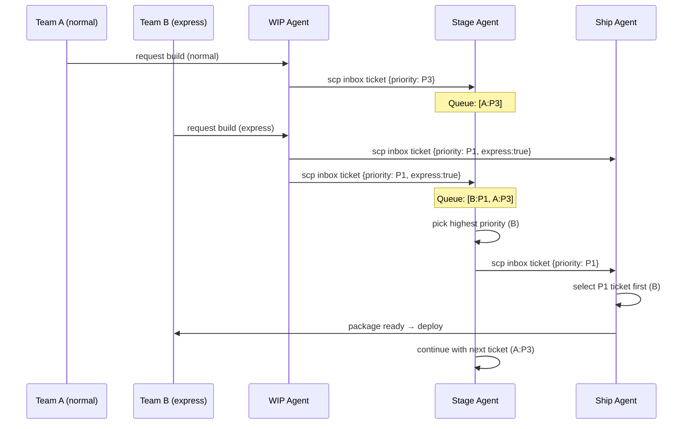
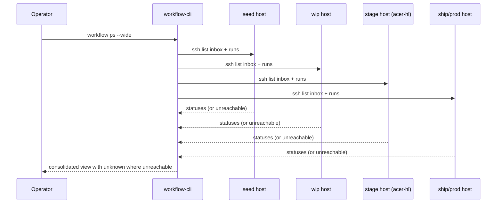

# Pipeline Flows Documentation

This document describes the main operational flows for the Nginx Reverse Proxy Pipeline system.

## Core Pipeline Architecture

The pipeline follows a **seed → wip → prep → ship** flow:

- **seed**: Exact replica from production (read-only reference)
- **wip**: Work-in-progress workspace for modifications and testing
- **prep**: Clean runtime built from wip (validation stage)
- **ship**: Self-contained deployment package ready for production

## Main Operational Flows

### 1. Nginx Configuration Update
**Use Case**: Refactoring nginx configuration, adding features, or improving structure

```bash
# Step 1: Get fresh copy from production
./scripts/safe-rp-ctl fetch-seed

# Step 2: Initialize WIP workspace
./scripts/safe-rp-ctl init-wip

# Step 3: Modify configuration in workspace/wip/
# - Convert monolithic nginx.conf to modular conf.d/
# - Add new features (e.g., rate limiting, caching)
# - Update security headers

# Step 4: Test WIP environment
./scripts/safe-rp-ctl start-wip
# Run tests, verify all sites work

# Step 5: Build and test prep
./scripts/safe-rp-ctl build-prep
./scripts/safe-rp-ctl start-prep
# Validate clean build

# Step 6: Build and test ship
./scripts/safe-rp-ctl build-ship
./scripts/safe-rp-ctl start-ship
# Final verification

# Step 7: Deploy to production
./scripts/safe-rp-ctl deploy-prod
```

### 2. Production Issue Fix
**Use Case**: Emergency fix for production issues

```bash
# Step 1: Get current production state
./scripts/safe-rp-ctl fetch-seed

# Step 2: Initialize WIP for debugging
./scripts/safe-rp-ctl init-wip

# Step 3: Lock WIP to preserve fix state
./scripts/safe-rp-ctl lock-wip "Fixing SSL certificate chain issue"

# Step 4: Apply fixes in workspace/wip/
# - Fix broken configurations
# - Update certificates
# - Resolve routing issues

# Step 5: Test fix
./scripts/safe-rp-ctl start-wip
# Verify issue is resolved

# Step 6: Fast-track through pipeline
./scripts/safe-rp-ctl build-prep
./scripts/safe-rp-ctl build-ship
./scripts/safe-rp-ctl deploy-prod
```

### 3. Application Addition or Update
**Use Case**: Deploy new application or update existing one

```bash
# Step 1: Place application artifact in intake/
cp myapp-v2.0.0.zip intake/

# Step 2: Get current production state
./scripts/safe-rp-ctl fetch-seed

# Step 3: Initialize WIP
./scripts/safe-rp-ctl init-wip

# Step 4: Build prep (processes intake automatically)
./scripts/safe-rp-ctl build-prep
# This extracts artifacts and integrates them

# Step 5: Test application
./scripts/safe-rp-ctl start-prep
# Verify new/updated app works

# Step 6: Build ship and deploy
./scripts/safe-rp-ctl build-ship
./scripts/safe-rp-ctl start-ship
./scripts/safe-rp-ctl deploy-prod
```

### 4. Application Decommission
**Use Case**: Remove an application from the proxy

```bash
# Step 1: Get current state
./scripts/safe-rp-ctl fetch-seed

# Step 2: Initialize WIP
./scripts/safe-rp-ctl init-wip

# Step 3: Remove application in workspace/wip/
# - Delete conf.d/myapp.conf
# - Remove info_pages/myapp/
# - Clean up certificates if app-specific

# Step 4: Test removal
./scripts/safe-rp-ctl start-wip
# Verify app is gone, no broken configs

# Step 5: Push through pipeline
./scripts/safe-rp-ctl build-prep
./scripts/safe-rp-ctl build-ship
./scripts/safe-rp-ctl deploy-prod
```

### 5. Infrastructure Migration
**Use Case**: Migrate to new infrastructure (e.g., new provider, new architecture)

```bash
# Step 1: Get replica from old production
./scripts/safe-rp-ctl fetch-seed --source old-prod

# Step 2: Initialize WIP
./scripts/safe-rp-ctl init-wip

# Step 3: Customize for new infrastructure
# - Update network configurations
# - Adjust paths and volumes
# - Modify port mappings
# - Update certificates for new domains

# Step 4: Test in new environment
./scripts/safe-rp-ctl start-wip
# Extensive testing with new infrastructure

# Step 5: Build for new environment
./scripts/safe-rp-ctl build-prep
./scripts/safe-rp-ctl build-ship --target new-prod

# Step 6: Deploy to new infrastructure
./scripts/safe-rp-ctl deploy-prod --target new-prod
```

## Additional Flows

### 6. Staging Environment Setup
**Use Case**: Create staging environment for testing

```bash
# Use ship package for staging
./scripts/safe-rp-ctl start-env stage
# This uses the ship package with staging ports (8080/8443)
```

### 7. Local Development
**Use Case**: Test changes locally before pushing to pipeline

```bash
# Work directly in WIP
./scripts/safe-rp-ctl start-wip
# Make changes, restart as needed
docker restart nginx-rp-wip
```

## Flow Principles

1. **Always start with seed**: Every flow begins by getting current production state
2. **Test at each stage**: Verify changes work before moving to next stage
3. **Use locks wisely**: Lock WIP when preserving manual fixes
4. **Document changes**: Keep track of what was modified and why
5. **Rollback ready**: Previous ship packages are kept for quick rollback

## Emergency Procedures

### Quick Rollback
```bash
# List available releases
./scripts/safe-rp-ctl list-releases

# Rollback to previous version
./scripts/safe-rp-ctl rollback v20250810-1234
```

### Skip Pipeline (Emergency Only)
```bash
# In extreme emergency, can deploy WIP directly
# NOT RECOMMENDED - bypasses safety checks
./scripts/safe-rp-ctl deploy-wip --force --emergency
```

## Best Practices

1. **Regular fetches**: Keep seed updated with production state
2. **Test thoroughly**: Each stage should be tested before proceeding
3. **Use intake**: Always use intake/ directory for new artifacts
4. **Maintain isolation**: Don't mix different changes in one pipeline run
5. **Document locks**: Always provide clear reason when locking WIP

---

## Federated Execution Model (Optional, Recommended for Multi-Node)

Some teams operate the pipeline as a federation of stage owners (seed, wip, prep/stage, ship/prod), where each environment hosts its own queue and local state. Handoffs between stages are lightweight "tickets" exchanged over SSH/SCP into inbox directories. This avoids any central server, enables offline progress, and allows local prioritization (including express deployments).

Key directories per environment (convention):

- `/var/lib/workflow/inbox/` — incoming tickets (JSON files); processed in priority order
- `/var/lib/workflow/processing/` — active lock while the run is executing
- `/var/lib/workflow/runs/<run_id>/` — canonical local state, logs, artifacts
- `/var/lib/workflow/outbox/` — tickets queued for the next environment if it is temporarily unreachable

### Flow progression (including express path)



### Message exchange via inboxes (priority handling)



### Status collection for active instances (no central server)



Notes:

- If an environment is unreachable, its state is reported as "unknown" rather than guessed.
- Prioritization is enforced locally by each environment using its inbox ordering.
- Handoffs are retried from the sender's outbox until the next environment is reachable.

---

## 8. Express Deployment (Priority Overtake)

**Use Case**: A critical fix must pass slower counterparts waiting in stage/ship and be processed immediately when resources free up.

Two ways to apply express priority:

- From WIP: submit an express ticket directly to stage and ship with `priority=P1`.
- At Stage: an admin can promote a waiting ticket by renaming the inbox file or editing its priority field.

### Example

```bash
# Team B prepares fix in WIP
./scripts/safe-rp-ctl build-prep   # produces validated prep artifacts locally

# The WIP agent sends tickets (JSON) to Stage and Ship inboxes with priority=P1
scp /tmp/ticket-express.json stage-host:/var/lib/workflow/inbox/
scp /tmp/ticket-express.json ship-host:/var/lib/workflow/inbox/

# Stage agent automatically prefers P1 over P3
# Ship agent will also prefer P1 if packaging can proceed in parallel
```

Minimal ticket schema (JSON):

```json
{
  "run_id": "2025-08-13-abc123",
  "workflow": "nginx-rp-pipeline@v1",
  "from_env": "wip",
  "requested_state": "stage",
  "priority": "P1",          
  "express": true,
  "submitted_at": "2025-08-13T19:35:02Z",
  "artifacts": {
    "uri": "ssh://wip-host:/var/lib/workflow/runs/2025-08-13-abc123/artifacts/",
    "checksum": "sha256:..."
  },
  "requested_by": "team-b"
}
```

Operational tips:

1. **Local priority policy**: stage and ship agents should order `inbox/` by `priority` then timestamp; `P1 > P2 > P3`.
2. **Preemption**: agents may finish the current task before picking the express one, unless configured for preemptive switch.
3. **Audit**: copy processed tickets into `/var/lib/workflow/runs/<run_id>/tickets/` for traceability.
4. **Local stage on acer-hl**: use the same inbox/outbox conventions to pilot changes safely before propagating to shared stage.
